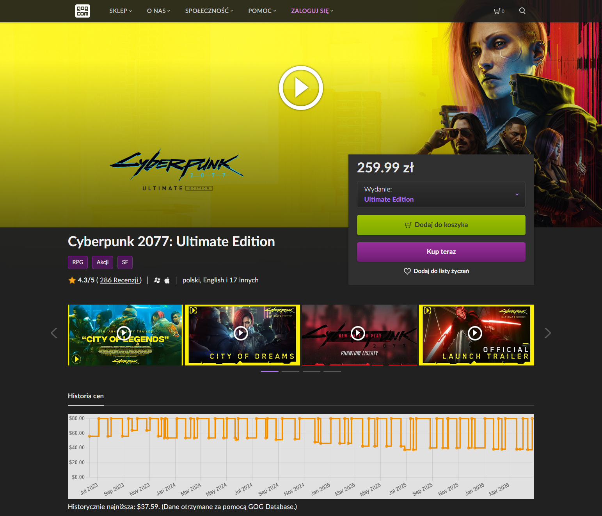

# GOG Price Charts

Skrypt pobierający dane historyczne dotyczące cen z [GOG DB](https://www.gogdb.org/), wyświetlający interaktywny wykres oraz wyświetlający najniższą znaną cenę na stronie GOG, by pomóc zdecydować, czy kupić grę teraz, czy poczekać na lepszą ofertę.

Pobiera on dane wyłącznie podczas przeglądania strony produktu konkretnej gry. Historia cen każdej gry jest buforowana przez 24 godziny, aby ograniczyć zbędne żądania kierowane do GOG DB. Czas przechowywania w pamięci podręcznej można dostosować, edytując wiersz 23 skryptu po jego zainstalowaniu.

## Zrzuty ekranu

## Kompatybilność
Ten skrypt był testowany jedynie z [Tampermonkey](https://addons.mozilla.org/en-US/firefox/addon/tampermonkey/) na [Firefoxie](https://www.mozilla.org/en-US/firefox/new/) oraz [Google Chrome](https://www.google.com/chrome/), choć pownien on także działać z innymi menadżerami skryptów, jak [Violentmonkey](https://addons.mozilla.org/en-US/firefox/addon/violentmonkey/), oraz innymi nowoczesnymi przeglądarkami.

## Instalacja
1. Zainstaluj menedżer skryptów dla swojej przeglądarki:
    * **Firefox**: [Greasemonkey](https://addons.mozilla.org/en-US/firefox/addon/greasemonkey/), [Tampermonkey](https://addons.mozilla.org/en-US/firefox/addon/tampermonkey/) lub [Violentmonkey](https://addons.mozilla.org/en-US/firefox/addon/violentmonkey/)
    * **Google Chrome** / **Vivaldi**: [Tampermonkey](https://chrome.google.com/webstore/detail/tampermonkey/dhdgffkkebhmkfjojejmpbldmpobfkfo) lub [Violentmonkey](https://chrome.google.com/webstore/detail/violentmonkey/jinjaccalgkegednnccohejagnlnfdag)
    * **Microsoft Edge**: [Tampermonkey](https://microsoftedge.microsoft.com/addons/detail/tampermonkey/iikmkjmpaadaobahmlepeloendndfphd) lub [Violentmonkey](https://microsoftedge.microsoft.com/addons/detail/violentmonkey/eeagobfjdenkkddmbclomhiblgggliao)
    * **Safari**: [Tampermonkey](https://apps.apple.com/app/tampermonkey/id6738342400)

2. Jeśli trzeba, zrestartuj przeglądarkę.

3. Zainstaluj skrypt z preferowanego źródła: [GitHub](https://raw.githubusercontent.com/idkicarus/GOG-price-charts/main/gog-price-chart.user.js) lub [Greasy Fork](https://greasyfork.org/en/scripts/527267-gogdb-price-charts).

4. Odwiedź stronę produktu na GOG. Przy pierwszej wizycie z włączonym skryptem, menedżer skryptów zapyta, czy chcesz zezwolić na dostęp do zasobów z innej domeny pod adresem www.gogdb.org. Kliknij „Zezwól” lub „Akceptuj”. Jeśli odmówisz dostępu, skrypt nie będzie mógł pobrać żadnych danych dotyczących poprzednich cen.

